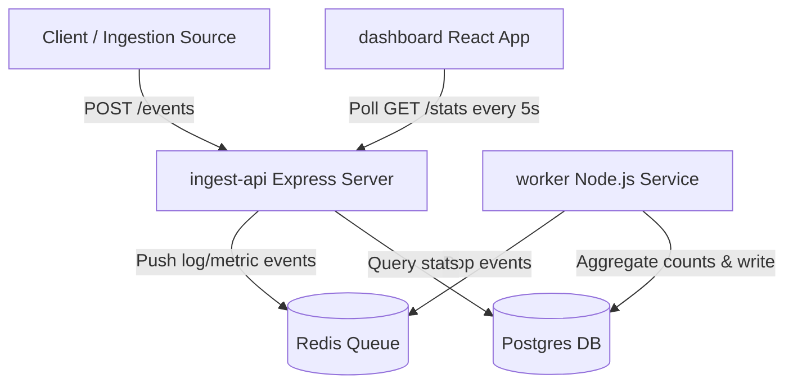

# DevOps Dashboard

A real-time DevOps analytics dashboard built to ingest, aggregate, and visualize application logs and metrics. 

## Architecture Overview



The system is composed of the following services:

1. **`ingest-api`**: Node.js + Express API. Exposes:
   - `POST /events` to receive event items and enqueue them into Redis.
   - `GET /stats` to fetch aggregated minute-by-minute metrics from PostgreSQL.
2. **`worker`**: Node.js microservice that pulls events from the Redis queue, aggregates counts grouped by event type and minute bucket, and inserts them into PostgreSQL with upsert queries.
3. **`dashboard`**: React single page application built with Vite and styled using a premium modern dark mode theme. Displays real-time charts using Recharts and enables triggering dummy test events right from the UI.
4. **`Redis`**: In-memory message queue broker.
5. **`PostgreSQL`**: Relational store for aggregated metrics.

---

## Getting Started

### Prerequisites

- [Docker](https://www.docker.com/) and Docker Compose installed.

### Setup and Running

1. **Clone the repository and inspect environments**:
   - Environment variables are predefined inside the services in `docker-compose.yml`.
   - A [`.env.example`](./.env.example) is provided for custom production reference.

2. **Start the applications**:
   Run the following command at the root of the workspace to build and run all services in the background:
   ```bash
   docker compose up --build -d
   ```

3. **Verify the services are running**:
   ```bash
   docker compose ps
   ```

4. **Access the services**:
   - **Dashboard**: `http://localhost`
   - **Ingest API**: `http://localhost:3000`

---

## Verifying System Behavior

### Option A: Using the Dashboard (Recommended)
Open `http://localhost` in your browser. The dashboard comes with a **Test Event Generator** card. You can click on the buttons to trigger:
- `Info` events
- `Warning` events
- `Error` events

After generating events, wait up to 5 seconds. You will see the event counts updated dynamically in the live bar chart.

### Option B: Using the CLI
Send a JSON POST request to the API manually:

**PowerShell:**
```powershell
Invoke-RestMethod -Uri http://localhost:3000/events -Method Post -Body '{"type":"error","message":"database failed"}' -ContentType 'application/json'
```

**cURL:**
```bash
curl -X POST http://localhost:3000/events \
  -H "Content-Type: application/json" \
  -d '{"type":"error","message":"database failed"}'
```

Verify that the `GET /stats` endpoint returns the aggregate data:
```bash
curl http://localhost:3000/stats
```
