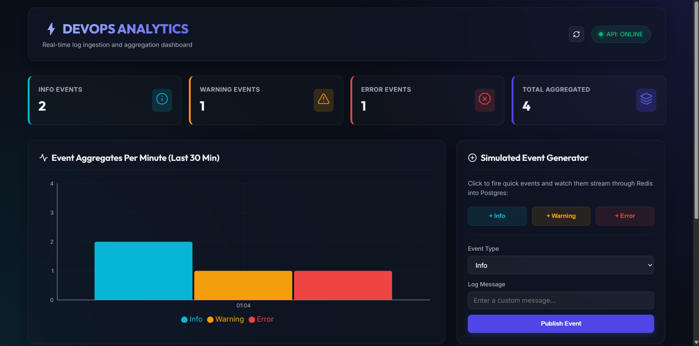
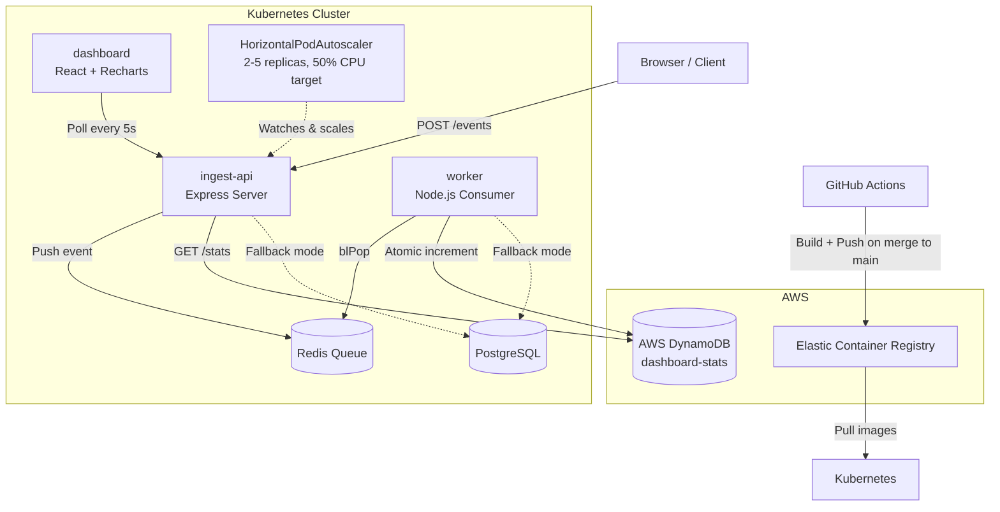
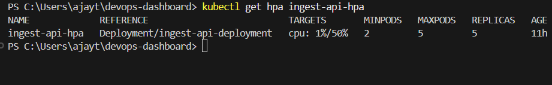
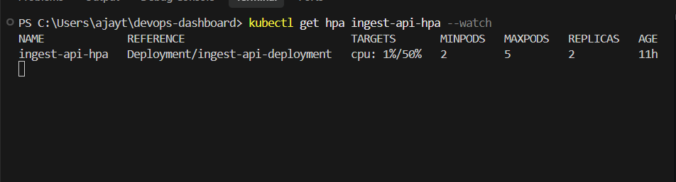

# DevOps Dashboard

A real-time log ingestion and aggregation platform built as a 3-tier microservices system — containerized with Docker, deployed on Kubernetes with CPU-based autoscaling, backed by AWS DynamoDB, and shipped via an automated CI/CD pipeline to AWS ECR.



---

## Architecture



### Why this shape

- **ingest-api** and **worker** are separate services because they have different load profiles — the API needs to respond fast to every incoming write, while the worker does slower aggregation work. Splitting them means a slow aggregation step never blocks incoming events, and a worker crash never takes down the API.
- **Redis** decouples producer from consumer — if the worker is briefly down or slow, events queue up instead of being dropped or blocking the API.
- **DynamoDB with atomic `UpdateItem` increments** (not read-then-write) avoids race conditions once multiple worker replicas are involved — a `GetItem` + `PutItem` pattern would lose updates under concurrent writes.

---

## Tech Stack

| Layer | Technology |
|---|---|
| Frontend | React, Vite, Recharts |
| Backend | Node.js, Express |
| Queue | Redis |
| Database | AWS DynamoDB (on-demand billing), PostgreSQL (local fallback) |
| Containerization | Docker, multi-stage builds |
| Orchestration | Kubernetes (minikube locally; portable to EKS) |
| Cloud | AWS (ECR, DynamoDB, IAM) |
| CI/CD | GitHub Actions |

---

## Running Locally (Docker Compose)

```bash
git clone https://github.com/tushit24/devops-dashboard.git
cd devops-dashboard
cp .env.example .env   # fill in your own values
docker compose up --build -d
```

Open `http://localhost` in your browser. Fire test events using the built-in generator buttons, or:

```bash
curl -X POST http://localhost:3000/events \
  -H "Content-Type: application/json" \
  -d '{"type":"info","message":"test event"}'
```

Set `USE_DYNAMODB=true` in `.env` (with valid AWS credentials) to write to DynamoDB instead of local Postgres.

---

## Running on Kubernetes (minikube)

```bash
minikube start --driver=docker
minikube addons enable metrics-server

# ECR image pull auth (token expires every 12h, re-run as needed)
kubectl create secret docker-registry regcred \
  --docker-server=<your-ecr-registry> \
  --docker-username=AWS \
  --docker-password=$(aws ecr get-login-password --region ap-south-1)

# Copy k8s/secret.yaml.example -> k8s/secret.yaml and fill in base64-encoded values, then:
kubectl apply -f k8s/

kubectl get pods
kubectl get hpa
```

Expose services locally (each needs its own terminal open, standard minikube-on-Windows behavior):

```bash
minikube service ingest-api-service --url
minikube service dashboard-service --url
```

---

## Autoscaling Demo (HorizontalPodAutoscaler)

The `ingest-api` Deployment is configured with an HPA targeting 50% CPU utilization, scaling between 2 and 5 replicas.

**Idle state — 2 replicas, low CPU:**
```
NAME             REFERENCE                          TARGETS       MINPODS   MAXPODS   REPLICAS
ingest-api-hpa   Deployment/ingest-api-deployment   cpu: 1%/50%   2         5         2
```

**Under load — scaled to maximum:**
```
NAME             REFERENCE                          TARGETS       MINPODS   MAXPODS   REPLICAS
ingest-api-hpa   Deployment/ingest-api-deployment   cpu: 1%/50%   2         5         5
```


**After load stops — scaled back down automatically:**
```
NAME             REFERENCE                          TARGETS       MINPODS   MAXPODS   REPLICAS
ingest-api-hpa   Deployment/ingest-api-deployment   cpu: 1%/50%   2         5         2
```


This was verified with a real load test against the live cluster — not simulated. metrics-server was enabled as a minikube addon to provide the CPU data the HPA reads from.

---

## CI/CD (GitHub Actions)

Every push to `main` triggers [`.github/workflows/deploy.yml`](.github/workflows/deploy.yml), which:

1. Builds Docker images for all three services
2. Authenticates with AWS ECR
3. Pushes each image tagged with the **short git commit SHA** (not `latest`)

Commit-SHA tagging means every deployed image traces back to an exact commit — useful for rollbacks and knowing precisely what code is running in the cluster at any time.


---

## Security Notes

- AWS access is scoped to a dedicated IAM user with a least-privilege custom policy — limited to ECR push/pull and access to a single named DynamoDB table, not full account access.
- Real credentials (`.env`, `k8s/secret.yaml`) are gitignored; only `.example` templates with placeholder values are committed.
- DynamoDB runs in on-demand (`PAY_PER_REQUEST`) billing mode to avoid hourly charges for an idle side project.
- This project intentionally avoids EKS and EC2 to prevent unnecessary AWS cost — Kubernetes runs locally via minikube, using the same manifest syntax that would apply to a production EKS cluster.

---

## What I'd change for production

- Replace the local `minikube service --url` tunnel workflow with a proper Ingress controller and stable DNS, removing the need to rebuild the frontend image every time a backend URL changes.
- Move Secrets management to AWS Secrets Manager or an External Secrets Operator instead of raw base64 Kubernetes Secrets.
- Add a Horizontal Pod Autoscaler for the `worker` service as well, scaled on Redis queue depth rather than CPU.